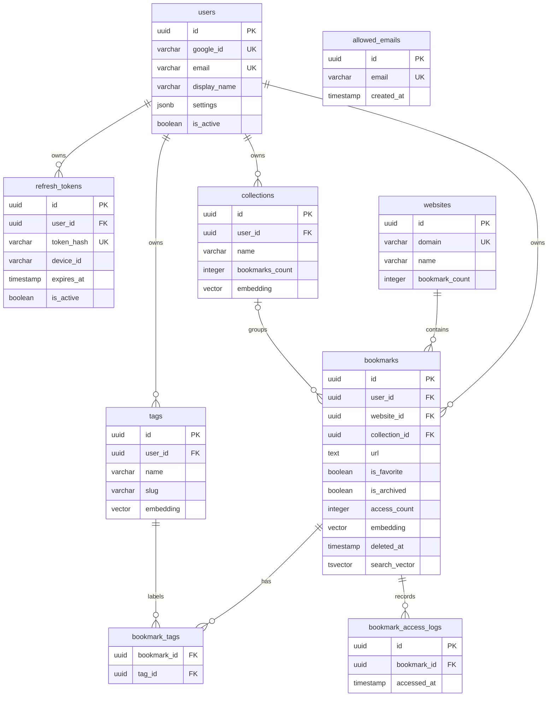

# Base De Datos

## Alcance

Este documento describe el esquema PostgreSQL actual de Tobimarks, sus
relaciones, índices, migraciones y reglas de acceso desde la aplicación. La
fuente de verdad del esquema son los archivos SQL de `migrations/`; este mapa
debe actualizarse cuando una migración cambie el modelo.

## Motor Y Extensiones

- PostgreSQL 15 o superior.
- `pg` para el acceso desde Node.js; no se usa ORM.
- `uuid-ossp` para generar UUID con `uuid_generate_v4()`.
- `pg_trgm` para búsquedas aproximadas de nombres de websites.
- `vector`/pgvector para embeddings de dimensión 1536.

Las extensiones se habilitan desde las migraciones con `IF NOT EXISTS`.

## Diagrama De Relaciones



## Tablas

### `users`

Usuario autenticado mediante Google.

| Columna                     | Tipo                       | Reglas                                 | Uso                      |
| --------------------------- | -------------------------- | -------------------------------------- | ------------------------ |
| `id`                        | `UUID`                     | PK, UUID por defecto                   | Identificador interno    |
| `google_id`                 | `VARCHAR(255)`             | Único, obligatorio                     | Identificador de Google  |
| `email`                     | `VARCHAR(255)`             | Único, obligatorio                     | Correo del usuario       |
| `display_name`              | `VARCHAR(255)`             | Obligatorio                            | Nombre visible           |
| `avatar_url`                | `TEXT`                     | Nullable                               | Avatar de Google         |
| `created_at` / `updated_at` | `TIMESTAMP WITH TIME ZONE` | Default `NOW()`                        | Auditoría temporal       |
| `last_login_at`             | `TIMESTAMP WITH TIME ZONE` | Nullable                               | Último inicio de sesión  |
| `is_active`                 | `BOOLEAN`                  | Default `true`                         | Estado de la cuenta      |
| `settings`                  | `JSONB`                    | Obligatorio, valores de IA por defecto | Preferencias del usuario |

### `refresh_tokens`

Sesiones persistentes por usuario y dispositivo. `user_id` referencia
`users(id)` con `ON DELETE CASCADE`.

| Columna                       | Tipo                       | Reglas                            | Uso                        |
| ----------------------------- | -------------------------- | --------------------------------- | -------------------------- |
| `id`                          | `UUID`                     | PK                                | Identificador del registro |
| `user_id`                     | `UUID`                     | FK, obligatorio                   | Propietario                |
| `token_hash`                  | `VARCHAR(255)`             | Único, obligatorio                | Hash del refresh token     |
| `device_id` / `device_name`   | `VARCHAR(255)`             | `device_id` participa en unicidad | Sesión por dispositivo     |
| `user_agent`                  | `TEXT`                     | Nullable                          | Metadatos de cliente       |
| `ip_address`                  | `INET`                     | Nullable                          | IP de la sesión            |
| `expires_at`                  | `TIMESTAMP WITH TIME ZONE` | Obligatorio                       | Caducidad                  |
| `created_at` / `last_used_at` | `TIMESTAMP WITH TIME ZONE` | Default `NOW()`                   | Ciclo de vida              |
| `is_active`                   | `BOOLEAN`                  | Default `true`                    | Revocación lógica          |

Restricciones: `UNIQUE(user_id, device_id)`. El repositorio usa `UPSERT` para
reemplazar la sesión de un dispositivo. Hay índices por `user_id`, expiración,
hash y estado activo/expiración.

### `websites`

Catálogo compartido de dominios. No pertenece a un usuario individual; varios
bookmarks pueden referenciar el mismo website.

| Columna                     | Tipo                       | Reglas             | Uso                 |
| --------------------------- | -------------------------- | ------------------ | ------------------- |
| `id`                        | `UUID`                     | PK                 | Identificador       |
| `domain`                    | `VARCHAR(255)`             | Único, obligatorio | Dominio normalizado |
| `name`                      | `VARCHAR(255)`             | Obligatorio        | Nombre mostrado     |
| `favicon_url`               | `TEXT`                     | Nullable           | Favicon             |
| `primary_color`             | `VARCHAR(7)`               | Nullable           | Color principal     |
| `bookmark_count`            | `INTEGER`                  | Default `0`        | Contador agregado   |
| `created_at` / `updated_at` | `TIMESTAMP WITH TIME ZONE` | Default `NOW()`    | Auditoría temporal  |

Tiene índices para `name`, búsqueda trigram (`GIN`), fecha de creación y
`bookmark_count`.

### `collections`

Colecciones propiedad de un usuario. `user_id` referencia `users(id)` con
`ON DELETE CASCADE`.

| Columna                     | Tipo                       | Reglas           | Uso                 |
| --------------------------- | -------------------------- | ---------------- | ------------------- |
| `id`                        | `UUID`                     | PK               | Identificador       |
| `user_id`                   | `UUID`                     | FK, obligatorio  | Propietario         |
| `name`                      | `VARCHAR(100)`             | Obligatorio      | Nombre              |
| `description`               | `TEXT`                     | Nullable         | Descripción         |
| `color`                     | `VARCHAR(20)`              | Nullable         | Presentación        |
| `icon`                      | `VARCHAR(50)`              | Default `folder` | Icono               |
| `bookmarks_count`           | `INTEGER`                  | Default `0`      | Contador agregado   |
| `embedding`                 | `VECTOR(1536)`             | Nullable         | Similitud semántica |
| `created_at` / `updated_at` | `TIMESTAMP WITH TIME ZONE` | Default `NOW()`  | Auditoría temporal  |

El embedding tiene un índice `ivfflat` con `vector_l2_ops` y 100 listas.

### `bookmarks`

Marcadores propiedad de un usuario. `user_id` referencia `users(id)` con
`ON DELETE CASCADE`; `website_id` referencia `websites(id)` y
`collection_id` referencia `collections(id)` con `ON DELETE SET NULL`.

| Columna                       | Tipo                       | Reglas          | Uso                                  |
| ----------------------------- | -------------------------- | --------------- | ------------------------------------ |
| `id`                          | `UUID`                     | PK              | Identificador                        |
| `user_id`                     | `UUID`                     | FK, obligatorio | Propietario                          |
| `website_id`                  | `UUID`                     | FK, obligatorio | Website asociado                     |
| `collection_id`               | `UUID`                     | FK, nullable    | Colección opcional                   |
| `url`                         | `TEXT`                     | Obligatorio     | URL normalizada                      |
| `title`                       | `VARCHAR(500)`             | Nullable        | Título editado                       |
| `description`                 | `TEXT`                     | Nullable        | Descripción editada                  |
| `og_title`                    | `VARCHAR(500)`             | Nullable        | Título Open Graph                    |
| `og_description`              | `TEXT`                     | Nullable        | Descripción Open Graph               |
| `og_image_url`                | `TEXT`                     | Nullable        | Imagen Open Graph                    |
| `is_favorite` / `is_archived` | `BOOLEAN`                  | Default `false` | Estados del bookmark                 |
| `last_accessed_at`            | `TIMESTAMP WITH TIME ZONE` | Nullable        | Último acceso                        |
| `access_count`                | `INTEGER`                  | Default `0`     | Total de accesos                     |
| `embedding`                   | `VECTOR(1536)`             | Nullable        | Reserva para procesamiento semántico |
| `created_at` / `updated_at`   | `TIMESTAMP WITH TIME ZONE` | Default `NOW()` | Auditoría temporal                   |
| `deleted_at`                  | `TIMESTAMP WITH TIME ZONE` | Nullable        | Soft delete                          |
| `search_vector`               | `TSVECTOR`                 | Nullable        | Reserva para full-text search        |

La URL es única por usuario únicamente mientras `deleted_at IS NULL`. Existen
índices por usuario, favoritos, archivados, fecha de creación, último acceso,
contador de accesos, colección y `search_vector`.

### `tags`

Etiquetas propiedad de un usuario. `user_id` referencia `users(id)` con
`ON DELETE CASCADE`.

| Columna                     | Tipo                       | Reglas          | Uso                   |
| --------------------------- | -------------------------- | --------------- | --------------------- |
| `id`                        | `UUID`                     | PK              | Identificador         |
| `user_id`                   | `UUID`                     | FK, obligatorio | Propietario           |
| `name`                      | `VARCHAR(50)`              | Obligatorio     | Nombre visible        |
| `description`               | `TEXT`                     | Nullable        | Descripción semántica |
| `slug`                      | `VARCHAR(50)`              | Obligatorio     | Identificador legible |
| `color`                     | `VARCHAR(100)`             | Nullable        | Presentación          |
| `embedding`                 | `VECTOR(1536)`             | Nullable        | Similitud semántica   |
| `created_at` / `updated_at` | `TIMESTAMP WITH TIME ZONE` | Default `NOW()` | Auditoría temporal    |

Restricción: `UNIQUE(user_id, slug)`. Hay índices por usuario, nombre y un
índice `ivfflat` para embeddings.

### `bookmark_tags`

Tabla puente de la relación muchos-a-muchos entre bookmarks y tags.

| Columna       | Tipo                       | Reglas                  | Uso                            |
| ------------- | -------------------------- | ----------------------- | ------------------------------ |
| `id`          | `UUID`                     | PK                      | Identificador de la asociación |
| `bookmark_id` | `UUID`                     | FK, `ON DELETE CASCADE` | Bookmark                       |
| `tag_id`      | `UUID`                     | FK, `ON DELETE CASCADE` | Tag                            |
| `created_at`  | `TIMESTAMP WITH TIME ZONE` | Default `NOW()`         | Fecha de asociación            |

Restricción: `UNIQUE(bookmark_id, tag_id)`.

### `bookmark_access_logs`

Historial de accesos a bookmarks. `bookmark_id` referencia `bookmarks(id)` con
`ON DELETE CASCADE`.

| Columna       | Tipo                       | Reglas          | Uso                      |
| ------------- | -------------------------- | --------------- | ------------------------ |
| `id`          | `UUID`                     | PK              | Identificador del evento |
| `bookmark_id` | `UUID`                     | FK, obligatorio | Bookmark accedido        |
| `accessed_at` | `TIMESTAMP WITH TIME ZONE` | Default `NOW()` | Momento del acceso       |

Hay índices por `bookmark_id` y `accessed_at`. El registro de acceso incrementa
también `bookmarks.access_count` y actualiza `last_accessed_at`.

### `allowed_emails`

Lista de correos permitidos cuando está habilitado
`ENABLE_EMAIL_WHITELIST`. No tiene FK a `users`, porque puede contener correos
antes del registro.

| Columna      | Tipo                       | Reglas             | Uso               |
| ------------ | -------------------------- | ------------------ | ----------------- |
| `id`         | `UUID`                     | PK                 | Identificador     |
| `email`      | `VARCHAR(255)`             | Único, obligatorio | Correo autorizado |
| `created_at` | `TIMESTAMP WITH TIME ZONE` | Default `NOW()`    | Fecha de alta     |

### `schema_migrations`

Tabla técnica creada por `scripts/migrate.ts` para registrar migraciones
aplicadas. No tiene migración SQL propia.

| Columna      | Tipo                       | Reglas             | Uso                   |
| ------------ | -------------------------- | ------------------ | --------------------- |
| `id`         | `SERIAL`                   | PK                 | Orden interno         |
| `filename`   | `VARCHAR(255)`             | Único, obligatorio | Archivo aplicado      |
| `applied_at` | `TIMESTAMP WITH TIME ZONE` | Default `NOW()`    | Momento de aplicación |

## Reglas De Integridad

- Todas las entidades principales usan UUID como clave primaria.
- Las relaciones de usuario (`refresh_tokens`, `collections`, `bookmarks` y
  `tags`) eliminan en cascada al eliminar el usuario.
- Eliminar un `website` no está definido con cascada en la FK de bookmarks; no se
  debe borrar un website compartido sin revisar sus referencias.
- Eliminar una colección deja `bookmarks.collection_id` en `NULL`.
- Eliminar un bookmark elimina sus asociaciones y su historial de accesos en
  cascada.
- La base no impone que el `user_id` de un bookmark coincida con el propietario
  de su colección o de sus tags; esa validación corresponde a casos de uso y
  repositorios.
- Los contadores `bookmarks_count`, `bookmark_count` y `access_count` son datos
  derivados y deben actualizarse junto con la operación que los modifica.
- Las lecturas normales de bookmarks deben filtrar `deleted_at IS NULL`.

## Migraciones

El orden actual es:

| Archivo                               | Cambio                               |
| ------------------------------------- | ------------------------------------ |
| `001_create_users.sql`                | Usuarios y extensión UUID            |
| `002_create_refresh_tokens.sql`       | Refresh tokens y sus índices         |
| `003_create_websites.sql`             | Websites, `pg_trgm` e índices        |
| `004_create_collections.sql`          | Colecciones y pgvector               |
| `005_create_bookmarks.sql`            | Bookmarks, soft delete e índices     |
| `006_create_tags.sql`                 | Tags, embeddings e índices           |
| `007_create_bookmark_tags.sql`        | Relación bookmark-tag                |
| `008_create_bookmark_access_logs.sql` | Historial de accesos                 |
| `009_alter_refresh_tokens.sql`        | Metadatos por dispositivo y unicidad |
| `010_create_allowed_emails.sql`       | Lista blanca de correos              |

El script de migración:

1. Crea `schema_migrations` si no existe.
2. Lee los `.sql` de `migrations/` y los ordena alfabéticamente.
3. Omite archivos ya registrados.
4. Ejecuta cada archivo dentro de `BEGIN`/`COMMIT` y hace `ROLLBACK` si falla.
5. Acepta `--files=001,002` para filtrar por prefijo.

Ejemplos:

```text
npm run db:migrate
npm run db:migrate -- --files=001,005
npm run db:reset
```

`db:reset` elimina el esquema `public` con `CASCADE`, lo recrea y reaplica las
migraciones. Solo debe usarse en una base desechable o cuando la pérdida total de
datos sea intencional.

## Acceso Desde La Aplicación

- `src/core/database/database-context.ts` administra el pool de PostgreSQL,
  limitado actualmente a 20 conexiones, con timeout de conexión de 2 segundos.
- Los repositorios están en `src/modules/*/repositories/` y dependen de
  interfaces (`IBookmarkRepository`, `ICollectionRepository`, etc.).
- `IUnitOfWork` mantiene un cliente del pool para agrupar consultas atómicas.
- Los valores siempre se pasan como parámetros (`$1`, `$2`, ...); el SQL dinámico
  solo puede construirse con nombres previamente incluidos en listas blancas.
- Los alias SQL convierten columnas `snake_case` a propiedades `camelCase`.

## Consideraciones Actuales

- `bookmarks.embedding` y `bookmarks.search_vector` existen en el esquema, pero
  su población o uso completo debe verificarse antes de implementar búsquedas
  sobre ellos.
- Los timestamps tienen defaults, pero no hay un trigger global visible que
  actualice automáticamente `updated_at`; cada operación de actualización debe
  hacerlo explícitamente cuando corresponda.
- Los índices `ivfflat` requieren embeddings previamente poblados para ser útiles.
- La documentación de este archivo describe el estado de las migraciones, no una
  futura normalización o un modelo alternativo.