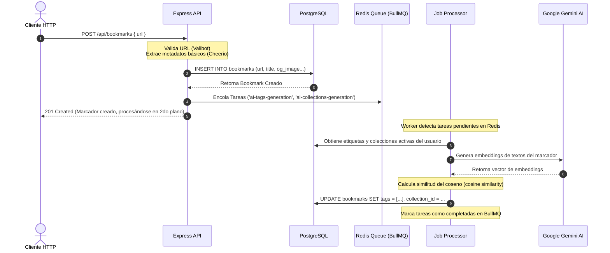

# 🔖 Tobimarks

<p align="center">
  
  
  
  
  
  
  
  
  
</p>

---

**Tobimarks** es una API RESTful avanzada y de alto rendimiento diseñada para la gestión, enriquecimiento y organización inteligente de marcadores web (bookmarks). Aprovechando el poder de la Inteligencia Artificial con **Google Gemini** para análisis semántico y un robusto motor de tareas asíncronas con **BullMQ** y **Redis**, Tobimarks automatiza la extracción de metadatos, el categorizado inteligente y la sugerencia de colecciones.

El proyecto está diseñado bajo una arquitectura limpia (**Clean Architecture**) orientada a dominios y altamente desacoplada mediante inyección de dependencias, garantizando mantenibilidad, robustez y escalabilidad.

---

## 🌟 Características Principales

*   **📥 Captura y Extracción de Metadatos Activa**: Web scraping en segundo plano usando `Cheerio` y `Axios` para extraer de forma automática y asíncrona: Títulos, Descripciones, Imágenes Open Graph (`og:image`), Favicons y URLs canónicas limpias.
*   **🧠 Inteligencia Artificial con Google Gemini**: Integración nativa con `@google/genai` para generar embeddings de alta dimensión del contenido de los marcadores.
*   **⚡ Motor de Colas Asíncronas (BullMQ & Redis)**: Arquitectura de tareas desacoplada para evitar bloqueos del hilo principal de Express. Procesa de manera resiliente:
    *   `ai-tags-generation`: Generación automática de etiquetas basadas en la similitud semántica del contenido con las etiquetas existentes del usuario (mediante embeddings y distancia coseno).
    *   `ai-collections-generation`: Clasificación y auto-asignación sugerida de colecciones.
*   **📂 Organización Dinámica**: Creación de colecciones personalizadas, asociación múltiple de etiquetas (tags), marcadores favoritos y soporte para archivado de enlaces.
*   **🔐 Autenticación Robusta**: Autenticación segura mediante JSON Web Tokens (JWT) y soporte para Google OAuth. Gestión segura de sesiones activas y Refresh Tokens por dispositivo.
*   **📊 Estadísticas Avanzadas**: Endpoint dedicado para obtener resúmenes cuantitativos de uso, favoritos y distribución de etiquetas.
*   **📖 Documentación de Nueva Generación**: Documentación interactiva autogenerada mediante OpenAPI 3.0 con Swagger y visualizada elegantemente a través de la interfaz interactiva de **Scalar** en `/api-docs`.

---

## 🛠 Tech Stack

| Capa / Componente | Tecnología Principal | Propósito |
| :--- | :--- | :--- |
| **Back-end Core** | TypeScript / Node.js (v20+) | Tipado estático robusto y entorno de ejecución rápido |
| **Framework Web** | Express 5.1 | Servidor HTTP moderno y flexible con soporte para promesas |
| **Base de Datos** | PostgreSQL (vía `pg`) | Base de datos relacional para almacenamiento persistente |
| **Colas de Tareas** | BullMQ & Redis | Procesamiento de trabajos pesados en segundo plano de manera confiable |
| **Inyección de Dependencias** | `tsyringe` | Inversión de Control (IoC) para desacoplamiento total de clases |
| **Validación de Datos** | `valibot` | Esquemas de validación de peticiones y variables de entorno rápidos y seguros |
| **Inteligencia Artificial** | `@google/genai` | Generación de embeddings vectoriales de contenido web |
| **Scraping / Metadatos** | `cheerio`, `axios`, `tldts` | Extracción de metadatos y normalización de URLs |
| **Seguridad** | `helmet`, `cors`, `express-rate-limit` | Protección contra vulnerabilidades web comunes y ataques DDoS |
| **Documentación** | `swagger-jsdoc` & Scalar | Especificación OpenAPI 3.0 y UI interactiva de referencia |

---

## 🏗 Arquitectura del Proyecto

El proyecto sigue los principios de **Clean Architecture** estructurado por módulos de negocio, lo que permite separar las preocupaciones del negocio (casos de uso) de las tecnologías externas (HTTP, Base de datos, Colas).

### Ciclo de Vida de una Petición con Tareas Asíncronas

El siguiente diagrama ilustra cómo interactúan los componentes cuando un usuario crea un marcador. La API responde inmediatamente mientras las tareas pesadas de IA y embeddings se delegan de manera asíncrona mediante BullMQ y Redis.



### Estructura de Directorios

```text
├── migrations/          # Scripts SQL de migración numerados para PostgreSQL
├── scripts/             # Scripts Node.js para mantenimiento y base de datos
│   ├── migrate.ts       # Script automatizado para aplicar migraciones pendientes
│   └── reset.ts         # Script para restablecer la base de datos a su estado inicial
├── src/
│   ├── common/          # Utilidades, middlewares globales y filtros compartidos
│   ├── core/            # Configuración base del sistema
│   │   ├── config/      # Configuraciones validadas (env, database, redis)
│   │   ├── database/    # Gestión de conexiones y cliente PostgreSQL
│   │   ├── di/          # Configuración del contenedor IoC (Inversión de Control)
│   │   └── logger/      # Servicio de logging estructurado con Pino
│   ├── modules/         # Dominios principales de negocio
│   │   ├── auth/        # Lógica de autenticación, JWT y Google OAuth
│   │   ├── bookmark/    # Núcleo: Marcadores, metadatos, tags y colas de tareas
│   │   ├── collection/  # Agrupación jerárquica de marcadores
│   │   ├── statistics/  # Métricas agregadas y resúmenes de uso
│   │   └── user/        # Gestión de perfiles y configuraciones de usuario
│   ├── app.ts           # Inicialización de Express y registro de rutas globales
│   ├── container.ts     # Registro global de dependencias (DI)
│   ├── index.ts         # Punto de entrada de la aplicación
│   ├── scalar.ts        # Renderizador interactivo de documentación Scalar
│   └── swagger.ts       # Configuración de especificaciones OpenAPI
├── package.json
└── tsconfig.json
```

---

## 📋 Requisitos Previos

Antes de comenzar, asegúrate de tener instalados los siguientes componentes:

*   **Node.js**: Versión 20 o superior.
*   **PostgreSQL**: Versión 15 o superior.
*   **Redis**: Versión 6 o superior (Requerido para el motor de colas en segundo plano BullMQ).
*   **Google Gemini**: Una clave de API de Gemini (`GEMINI_API_KEY`) para activar las funcionalidades de IA.
*   **Google Cloud Console**: Un proyecto configurado para obtener credenciales OAuth (opcional para desarrollo básico).

---

## ⚙️ Variables de Entorno (.env)

El proyecto utiliza un sistema de validación estricta de variables de entorno mediante **Valibot** (`src/core/config/env.config.ts`). Si alguna variable requerida falta o tiene un formato no válido, la aplicación fallará con un mensaje claro al arrancar.

Copia el archivo de ejemplo para iniciar tu configuración:

```bash
cp .env.example .env
```

Configura las variables dentro del archivo `.env` según la siguiente tabla:

| Variable | Requerido | Descripción | Ejemplo / Default |
| :--- | :---: | :--- | :--- |
| **Servidor y Entorno** | | | |
| `PORT` | ❌ | Puerto de red de la API (debe estar entre 1000 y 65535) | `3000` |
| `NODE_ENV` | ❌ | Entorno de ejecución (`DEVELOPMENT`, `PRODUCTION`, `TEST`) | `DEVELOPMENT` |
| `CORS_ORIGIN` | ❌ | Origen permitido para peticiones CORS | `http://localhost:5173` |
| `LOG_LEVEL` | ❌ | Nivel mínimo de logging (`fatal`, `error`, `warn`, `info`, `debug`) | `info` |
| **Base de Datos** | | | |
| `DB_HOST` |  | Host del servidor PostgreSQL | `localhost` |
| `DB_PORT` | ❌ | Puerto del servidor PostgreSQL | `5432` |
| `DB_NAME` |  | Nombre de la base de datos | `tobimarks` |
| `DB_USER` |  | Nombre del usuario de PostgreSQL | `postgres` |
| `DB_PASSWORD` |  | Contraseña del usuario de la base de datos | `tu_contraseña` |
| **Redis Cache** | | | |
| `REDIS_HOST` | ❌ | Host del servidor Redis principal | `localhost` |
| `REDIS_PORT` | ❌ | Puerto del servidor Redis principal | `6379` |
| `REDIS_PASSWORD` | ❌ | Contraseña de autenticación de Redis | `(Vacio)` |
| `REDIS_DB` | ❌ | Número de base de datos de Redis para caché | `0` |
| `REDIS_USE_TLS` | ❌ | Habilitar conexión SSL/TLS (`true`/`false`) | `false` |
| **Redis Queue (BullMQ)** | | | |
| `REDIS_QUEUE_HOST` | ❌ | Host de Redis dedicado a colas de BullMQ | `localhost` |
| `REDIS_QUEUE_PORT` | ❌ | Puerto de Redis dedicado a colas de BullMQ | `6380` |
| `REDIS_QUEUE_PASSWORD` | ❌ | Contraseña de Redis para colas | `(Vacio)` |
| `REDIS_QUEUE_DB` | ❌ | Número de base de datos de Redis para colas | `0` |
| `REDIS_QUEUE_USE_TLS`| ❌ | Habilitar SSL/TLS para la conexión de la cola | `false` |
| **Google OAuth** | | | |
| `GOOGLE_CLIENT_ID` |  | Client ID de Google Web Application | `your_client_id.apps.googleusercontent.com` |
| `GOOGLE_CLIENT_SECRET`|  | Client Secret de la aplicación de Google | `your_client_secret` |
| **Seguridad JWT** | | | |
| `JWT_SECRET` |  | Frase secreta robusta para firmar los tokens de acceso | `una_clave_muy_segura_y_larga` |
| `JWT_EXPIRES_IN` |  | Tiempo de expiración del token JWT en segundos | `3600` |
| **Inteligencia Artificial**| | | |
| `GEMINI_API_KEY` |  | API Key de Google Gemini AI | `AIzaSy...` |
| **Feature Flags** | | | |
| `ENABLE_EMAIL_WHITELIST`| ❌ | Restringir el registro a una lista blanca de correos | `false` |

> *Nota: Las variables sin la marca ❌ son **estrictamente obligatorias**.*

---

## 🚀 Empezando (Desarrollo Local)

Sigue estos pasos para poner en marcha el proyecto de forma local.

### 1. Clonar e Instalar Dependencias

```bash
git clone https://github.com/tu-usuario/tobimarks.git
cd tobimarks
npm install
```

### 2. Levantar Servicios Requeridos

Asegúrate de que PostgreSQL y Redis estén corriendo. Si usas Docker, puedes levantarlos rápidamente con:

```bash
docker run --name tobimarks-postgres -e POSTGRES_PASSWORD=mysecretpassword -e POSTGRES_DB=tobimarks -p 5432:5432 -d postgres:15
docker run --name tobimarks-redis -p 6379:6379 -d redis:7
```

### 3. Configurar el archivo `.env`

Copia el archivo `.env.example` como se describe en la sección anterior y completa tus credenciales. Asegúrate de crear la base de datos correspondiente en PostgreSQL si no se creó automáticamente.

### 4. Ejecutar Migraciones de Base de Datos

El proyecto cuenta con scripts automáticos que crean las tablas y administran el historial en la base de datos de forma segura:

```bash
# Aplicar todas las migraciones SQL pendientes en la base de datos
npm run db:migrate

# (Opcional) Si necesitas reiniciar la base de datos (borra tablas y vuelve a aplicar todo)
npm run db:reset
```

> *Tip: El comando de migraciones admite el parámetro `--files=001,002` para aplicar scripts específicos de forma manual si es necesario.*

### 5. Iniciar el Servidor de Desarrollo

Inicia la aplicación en modo desarrollo con recarga en caliente automática (hot-reload):

```bash
npm run dev
```

El servidor iniciará en: [http://localhost:3000](http://localhost:3000).

---

## 📚 Referencia de la API

Tobimarks ofrece una suite completa de endpoints REST. Todos los endpoints REST se encuentran bajo el prefijo `/api`.

### 📖 Documentación Interactiva (Scalar)

Para explorar la documentación OpenAPI interactiva detallada con ejemplos prácticos y consola de pruebas incorporada, inicia el servidor y dirígete a:

👉 **[http://localhost:3000/api-docs](http://localhost:3000/api-docs)**

---

### Resumen de Endpoints Principales

A continuación se muestra un resumen rápido de las rutas disponibles:

| Módulo | Endpoint | Método | Descripción |
| :--- | :--- | :---: | :--- |
| **Auth** | `/api/auth/google` | `POST` | Iniciar sesión / registrarse mediante Google OAuth |
| | `/api/auth/refresh` | `POST` | Renovar el Access Token usando un Refresh Token |
| | `/api/auth/logout` | `POST` | Cerrar sesión y revocar el Refresh Token activo |
| **Bookmarks** | `/api/bookmarks` | `POST` | Crear un marcador (Scraping y embeddings en 2do plano) |
| | `/api/bookmarks` | `GET` | Obtener marcadores paginados, filtrados y buscados |
| | `/api/bookmarks/:id` | `PATCH` | Actualizar título, descripción o metadatos de un marcador |
| | `/api/bookmarks/:id` | `DELETE` | Eliminar permanentemente un marcador |
| | `/api/bookmarks/:id/collection`| `PATCH` | Asignar un marcador a una colección específica |
| | `/api/bookmarks/:id/collection`| `DELETE`| Remover un marcador de su colección |
| | `/api/bookmarks/:id/favorite` | `PATCH` | Marcar como favorito |
| | `/api/bookmarks/:id/favorite` | `DELETE`| Quitar de favoritos |
| | `/api/bookmarks/:id/access` | `PATCH` | Registrar un acceso directo al marcador (incrementa visitas) |
| **Collections**| `/api/collections` | `POST` | Crear una nueva colección |
| | `/api/collections` | `GET` | Listar todas las colecciones del usuario |
| | `/api/collections/:id` | `GET` | Obtener detalles de una colección |
| | `/api/collections/:id` | `PATCH` | Actualizar nombre o descripción de una colección |
| **Tags** | `/api/tags` | `GET` | Listar las etiquetas creadas por el usuario |
| | `/api/tags` | `POST` | Crear una etiqueta de manera manual |
| | `/api/tags/:id` | `PATCH` | Actualizar el nombre o color de una etiqueta |
| | `/api/tags/:id` | `DELETE` | Eliminar una etiqueta |
| **Websites** | `/api/websites` | `GET` | Obtener sitios web únicos consolidados del usuario |
| **User** | `/api/users/me` | `GET` | Obtener perfil del usuario autenticado |
| | `/api/users/me/settings` | `PATCH` | Actualizar preferencias y configuraciones del usuario |
| **Statistics** | `/api/statistics/summary` | `GET` | Obtener dashboard de uso (totales, favoritos, tags más usados) |

---

## 🛠 Scripts Disponibles

En el directorio raíz, puedes ejecutar los siguientes comandos:

*   `npm run dev`: Inicia el servidor de desarrollo utilizando `tsx watch` que recarga el código al guardar cambios.
*   `npm run build`: Compila el código TypeScript a JavaScript de alta fidelidad y optimizado en la carpeta `/dist` utilizando `tsup`.
*   `npm run start`: Inicia el servidor optimizado para producción corriendo sobre Node.js. (Requiere haber ejecutado `npm run build` primero).
*   `npm run db:migrate`: Aplica las migraciones de esquemas SQL pendientes a PostgreSQL.
*   `npm run db:reset`: Ejecuta una reversión completa de las tablas del esquema e inicializa todo de nuevo.

---

## ⚠️ Solución de Problemas (Troubleshooting)

### Error `ECONNREFUSED` hacia la Base de Datos
*   **Causa**: La aplicación no logra conectar con PostgreSQL.
*   **Solución**: Verifica que tu servidor de base de datos PostgreSQL esté activo. Comprueba que las credenciales (`DB_HOST`, `DB_PORT`, `DB_NAME`, `DB_USER` y `DB_PASSWORD`) en tu archivo `.env` coincidan exactamente con tu servidor.

### Inyección de Dependencias no Resuelta (`tsyringe`)
*   **Causa**: Error al arrancar la aplicación (`Cannot inject the dependency...`).
*   **Solución**: Asegúrate de que las clases decoradas tengan `@injectable()` y estén debidamente registradas en `src/container.ts`. Asegúrate de que los tokens utilizados correspondan a los tokens inyectables correctos en `src/core/di/tokens.ts` o similares.

### Las colas de BullMQ no avanzan o se quedan estancadas
*   **Causa**: No hay conexión activa a Redis o el worker de colas no está inicializado.
*   **Solución**: Verifica que tu servidor Redis esté activo ejecutando `redis-cli ping` (debe responder `PONG`). Asegúrate de configurar correctamente los puertos y hosts de Redis para la cola (`REDIS_QUEUE_HOST` y `REDIS_QUEUE_PORT`).

### Error de validación de variables de entorno al iniciar
*   **Causa**: La aplicación arroja un log de nivel `fatal` indicando que la validación de entorno falló.
*   **Solución**: Esto ocurre gracias a las validaciones estrictas de **Valibot**. Verifica la consola para saber exactamente qué variable falta o tiene un tipo incorrecto. Asegúrate de no tener comillas innecesarias o puertos fuera de los rangos válidos.