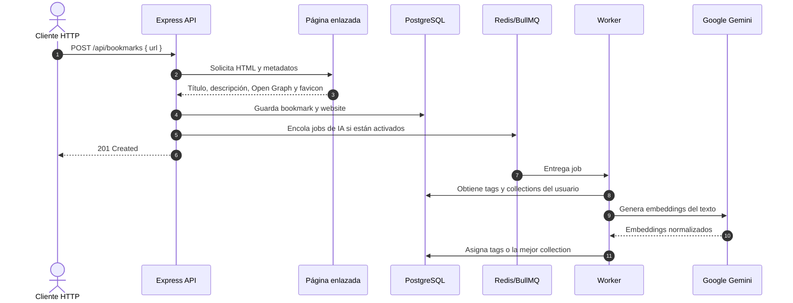

# Tobimarks

<p align="center">
  
  
  
  
  
  
  
</p>

> Guarda una URL. Tobimarks se encarga de enriquecerla y ayudarte a organizarla.

Tobimarks es una API REST y backend para gestionar bookmarks personales. Recibe
una URL, obtiene la información relevante de la página y la convierte en un
recurso fácil de organizar mediante colecciones, etiquetas, favoritos y
actividad de acceso.

La organización asistida por IA es opcional. Cuando está activada, Tobimarks
utiliza Google Gemini para relacionar el contenido de cada bookmark con las
etiquetas y colecciones que ya utiliza el usuario. Así, la clasificación se
adapta a la forma en que cada persona organiza sus propios enlaces.

Este repositorio contiene el backend y la API. No incluye una interfaz web.

## El Producto

Guardar enlaces es sencillo. Encontrarlos y mantenerlos organizados con el
tiempo es lo difícil. Tobimarks centraliza ese flujo:

- Captura URLs y extrae sus metadatos automáticamente.
- Normaliza la información del sitio y reutiliza su dominio en un catálogo de websites.
- Permite organizar bookmarks en una colección y asociarles varias etiquetas.
- Ofrece favoritos, registro de accesos, filtros, ordenamiento y estadísticas.
- Puede clasificar bookmarks con IA sin bloquear el procesamiento principal de la API.
- Mantiene los datos aislados por usuario.

### Cómo funciona

1. El usuario inicia sesión mediante Google.
2. Envía una URL a `POST /api/bookmarks` y, opcionalmente, una colección.
3. Tobimarks consulta la página y extrae título, descripción, datos Open Graph,
   imagen, favicon y URL canónica.
4. Guarda el bookmark asociado al usuario y al dominio correspondiente.
5. Si las opciones de IA están activadas, encola trabajos para buscar etiquetas
   similares y asignar la colección más relevante.

La extracción de metadatos forma parte de la creación del bookmark. La
organización con IA se ejecuta posteriormente mediante trabajos en segundo
plano.

## Capacidades

### Captura Y Enriquecimiento

- Recibe y valida URLs.
- Extrae título, descripción, `og:title`, `og:description`, `og:image`, favicon
  y URL canónica.
- Normaliza la URL cuando la página proporciona una versión canónica válida.
- Agrupa los bookmarks por dominio en un catálogo de websites reutilizable.

### Organización Personal

- Crea colecciones con nombre, descripción, color e icono.
- Crea etiquetas con nombre, descripción y color.
- Asocia múltiples etiquetas a un bookmark.
- Asigna o retira un bookmark de una colección.
- Marca y desmarca favoritos.
- Registra cuántas veces se accede a cada bookmark y cuándo ocurrió el último acceso.

### Organización Asistida Por IA

La IA se controla desde las preferencias del usuario:

- `aiAutoTags`: busca coincidencias entre el texto del bookmark y las etiquetas existentes.
- `aiAutoCollections`: busca la colección más relevante cuando el bookmark aún no tiene una.

La implementación actual:

- Usa embeddings de Google Gemini y similitud semántica con un umbral predeterminado de `0.7`.
- Asigna todas las etiquetas que superan el umbral.
- Asigna únicamente la colección con mejor coincidencia.
- No reemplaza una colección que ya fue asignada manualmente.
- Omite el trabajo si el usuario no tiene etiquetas o colecciones, si el bookmark no existe
  o si no hay texto suficiente para analizar.
- Procesa los trabajos con BullMQ y Redis, con reintentos y backoff exponencial.

La IA no crea una taxonomía global ni realiza una búsqueda semántica general de todos los
bookmarks. Trabaja con las etiquetas y colecciones que pertenecen al usuario.

### Consulta Y Actividad

La API permite consultar bookmarks de forma paginada y filtrarlos por:

- Estado de favorito.
- Colección, incluyendo bookmarks sin colección.
- Una o varias etiquetas.
- Fecha de creación, último acceso o cantidad de accesos.
- Accesos ocurridos durante la última semana, el último mes o todo el tiempo.

También expone un resumen estadístico del uso de bookmarks, colecciones y etiquetas.

## Casos De Uso

- Mantener una biblioteca personal de recursos de desarrollo.
- Organizar referencias de diseño, investigación o aprendizaje.
- Guardar artículos para leer y separarlos por temas.
- Clasificar enlaces de proyectos utilizando etiquetas propias.
- Construir un cliente web o móvil sobre una API de bookmarks con organización asistida por IA.

## Ejemplo Rápido

Después de autenticarte y obtener un access token:

```bash
curl -X POST http://localhost:3000/api/bookmarks \
  -H "Authorization: Bearer <access-token>" \
  -H "Content-Type: application/json" \
  -d '{"url":"https://www.typescriptlang.org/"}'
```

La respuesta crea el bookmark con sus datos básicos. Si la organización automática está
activada, las etiquetas y la colección se procesan en segundo plano.

## Referencia De La API

Todas las rutas de negocio utilizan el prefijo `/api`. Las rutas de bookmarks, colecciones,
etiquetas, websites, usuarios y estadísticas requieren un Bearer token. Las rutas de
autenticación no requieren un token previo.

La documentación interactiva está disponible en:

**[http://localhost:3000/api-docs](http://localhost:3000/api-docs)**

### Endpoints Principales

| Módulo      |  Método  | Endpoint                        | Uso                                                     |
| :---------- | :------: | :------------------------------ | :------------------------------------------------------ |
| Auth        |  `POST`  | `/api/auth/google`              | Iniciar sesión o registrar al usuario mediante Google   |
| Auth        |  `POST`  | `/api/auth/refresh`             | Renovar el access token                                 |
| Auth        |  `POST`  | `/api/auth/logout`              | Revocar un refresh token                                |
| Bookmarks   |  `POST`  | `/api/bookmarks`                | Crear un bookmark y extraer sus metadatos               |
| Bookmarks   |  `GET`   | `/api/bookmarks`                | Listar bookmarks con paginación, filtros y ordenamiento |
| Bookmarks   | `PATCH`  | `/api/bookmarks/:id`            | Actualizar título, etiquetas o colección                |
| Bookmarks   | `DELETE` | `/api/bookmarks/:id`            | Eliminar lógicamente un bookmark                        |
| Bookmarks   | `PATCH`  | `/api/bookmarks/:id/collection` | Asignar una colección                                   |
| Bookmarks   | `DELETE` | `/api/bookmarks/:id/collection` | Retirar la colección                                    |
| Bookmarks   | `PATCH`  | `/api/bookmarks/:id/favorite`   | Marcar como favorito                                    |
| Bookmarks   | `DELETE` | `/api/bookmarks/:id/favorite`   | Quitar de favoritos                                     |
| Bookmarks   | `PATCH`  | `/api/bookmarks/:id/access`     | Registrar un acceso                                     |
| Collections |  `POST`  | `/api/collections`              | Crear una colección                                     |
| Collections |  `GET`   | `/api/collections`              | Listar colecciones paginadas                            |
| Collections |  `GET`   | `/api/collections/:id`          | Consultar una colección                                 |
| Collections | `PATCH`  | `/api/collections/:id`          | Actualizar una colección                                |
| Tags        |  `GET`   | `/api/tags`                     | Listar etiquetas del usuario                            |
| Tags        |  `POST`  | `/api/tags`                     | Crear una etiqueta                                      |
| Tags        | `PATCH`  | `/api/tags/:id`                 | Actualizar una etiqueta                                 |
| Tags        | `DELETE` | `/api/tags/:id`                 | Eliminar una etiqueta                                   |
| Websites    |  `GET`   | `/api/websites`                 | Listar websites asociados a los bookmarks del usuario   |
| User        |  `GET`   | `/api/users/me`                 | Consultar el perfil autenticado                         |
| User        | `PATCH`  | `/api/users/me/settings`        | Actualizar preferencias de IA                           |
| Statistics  |  `GET`   | `/api/statistics/summary`       | Obtener el resumen de uso                               |

Las respuestas siguen este formato general:

```json
{
  "success": true,
  "data": {},
  "message": "Optional message",
  "meta": {}
}
```

Los errores utilizan el formato:

```json
{
  "success": false,
  "message": "Error description",
  "errorCode": "ERROR_CODE"
}
```

## Requisitos

- Node.js 20 o superior.
- PostgreSQL 15 o superior con soporte para `pgvector`.
- Redis 6 o superior.
- Un cliente OAuth de Google para aplicaciones web.
- Una API key de Google Gemini.

Las migraciones habilitan o utilizan las extensiones `uuid-ossp`, `pg_trgm` y `vector`.
El servicio de PostgreSQL debe tener disponible `pgvector` antes de ejecutar las migraciones.

## Instalación Local

### 1. Clonar E Instalar

```bash
git clone https://github.com/Jose-Maykol/tobimarks.git
cd tobimarks
npm install
```

### 2. Levantar Redis

El archivo `docker-compose.yml` levanta dos instancias de Redis: una para caché y otra para
las colas de BullMQ.

```bash
docker compose up -d
```

PostgreSQL debe estar disponible por separado y debe utilizar una instalación o imagen que
incluya `pgvector`.

### 3. Configurar El Entorno

```bash
cp .env.example .env
```

En PowerShell puedes utilizar:

```powershell
Copy-Item .env.example .env
```

Completa las credenciales de PostgreSQL, Google OAuth, JWT y Gemini. La aplicación valida
las variables al arrancar y termina si falta alguna variable obligatoria.

### 4. Ejecutar Las Migraciones

```bash
npm run db:migrate
```

Para aplicar migraciones concretas por prefijo:

```bash
npm run db:migrate -- --files=001,005
```

`npm run db:reset` elimina el esquema `public` con `CASCADE` y reaplica todas las migraciones.
Utilízalo únicamente en una base de datos desechable.

### 5. Iniciar La API

```bash
npm run dev
```

La API quedará disponible en `http://localhost:3000` y la documentación interactiva en
`http://localhost:3000/api-docs`.

## Variables De Entorno

Las variables reales deben mantenerse en `.env`, nunca en el repositorio.

| Variable                 | Requerida | Default                 | Propósito                                |
| :----------------------- | :-------: | :---------------------- | :--------------------------------------- |
| `PORT`                   |    No     | `3000`                  | Puerto HTTP de la API                    |
| `NODE_ENV`               |    No     | `DEVELOPMENT`           | Entorno de ejecución                     |
| `CORS_ORIGIN`            |    No     | `http://localhost:5173` | Origen permitido por CORS                |
| `LOG_LEVEL`              |    No     | `info`                  | Nivel de logging                         |
| `DB_HOST`                |    Sí     | -                       | Host de PostgreSQL                       |
| `DB_PORT`                |    No     | `5432`                  | Puerto de PostgreSQL                     |
| `DB_NAME`                |    Sí     | -                       | Nombre de la base de datos               |
| `DB_USER`                |    Sí     | -                       | Usuario de PostgreSQL                    |
| `DB_PASSWORD`            |    Sí     | -                       | Contraseña de PostgreSQL                 |
| `REDIS_HOST`             |    No     | `localhost`             | Redis de caché                           |
| `REDIS_PORT`             |    No     | `6379`                  | Puerto de Redis de caché                 |
| `REDIS_PASSWORD`         |    No     | vacío                   | Contraseña de Redis de caché             |
| `REDIS_DB`               |    No     | `0`                     | Base de datos de Redis de caché          |
| `REDIS_USE_TLS`          |    No     | `false`                 | TLS para Redis de caché                  |
| `REDIS_QUEUE_HOST`       |    No     | `localhost`             | Redis de BullMQ                          |
| `REDIS_QUEUE_PORT`       |    No     | `6380`                  | Puerto de Redis de BullMQ                |
| `REDIS_QUEUE_PASSWORD`   |    No     | vacío                   | Contraseña de Redis de BullMQ            |
| `REDIS_QUEUE_DB`         |    No     | `0`                     | Base de datos de Redis de BullMQ         |
| `REDIS_QUEUE_USE_TLS`    |    No     | `false`                 | TLS para Redis de BullMQ                 |
| `GOOGLE_CLIENT_ID`       |    Sí     | -                       | Client ID de Google OAuth                |
| `GOOGLE_CLIENT_SECRET`   |    Sí     | -                       | Client secret de Google OAuth            |
| `JWT_SECRET`             |    Sí     | -                       | Secreto para firmar access tokens        |
| `JWT_EXPIRES_IN`         |    Sí     | -                       | Expiración del JWT en segundos           |
| `GEMINI_API_KEY`         |    Sí     | -                       | API key para embeddings de Gemini        |
| `ENABLE_EMAIL_WHITELIST` |    No     | `false`                 | Restringir registros a emails permitidos |

## Arquitectura

Tobimarks está organizado por módulos de negocio y utiliza una separación por capas inspirada
en Clean Architecture. La implementación actual combina la API y los workers de BullMQ en el
mismo proceso.



### Componentes

| Componente                | Tecnología              | Responsabilidad                                    |
| :------------------------ | :---------------------- | :------------------------------------------------- |
| API HTTP                  | Express 5 y TypeScript  | Rutas, validación y respuestas JSON                |
| Persistencia              | PostgreSQL y `pg`       | Usuarios, bookmarks, colecciones, tags y actividad |
| Similitud semántica       | `pgvector` y Gemini     | Embeddings para tags y colecciones                 |
| Caché                     | Redis                   | Caché de perfiles y datos temporales               |
| Trabajos                  | BullMQ y Redis dedicado | Organización con IA en segundo plano               |
| Inyección de dependencias | `tsyringe`              | Composición de módulos y servicios                 |
| Validación                | Valibot                 | Peticiones HTTP y configuración de entorno         |
| Documentación             | OpenAPI y Scalar        | Referencia interactiva de la API                   |

### Estructura Principal

```text
├── migrations/             # Migraciones SQL numeradas
├── scripts/                # Migración y reset de base de datos
├── src/
│   ├── common/             # Middlewares, respuestas y errores compartidos
│   ├── core/               # Configuración, PostgreSQL, Redis, colas, IA y logging
│   ├── modules/
│   │   ├── auth/           # Google OAuth, JWT y refresh tokens
│   │   ├── bookmark/       # Bookmarks, metadatos, websites y jobs de IA
│   │   ├── collection/     # Colecciones del usuario
│   │   ├── statistics/     # Resúmenes de uso
│   │   ├── tag/            # Etiquetas y similitud semántica
│   │   └── user/           # Perfil y preferencias
│   ├── app.ts              # Aplicación Express y rutas
│   ├── container.ts        # Registro global de dependencias
│   ├── index.ts            # Punto de entrada
│   ├── scalar.ts           # Configuración de Scalar
│   └── swagger.ts          # Especificación OpenAPI
├── .env.example
├── docker-compose.yml
└── package.json
```

Para más detalle consulta:

- [Arquitectura](ARCHITECTURE.md)
- [Modelo de datos](DATABASE.md)
- [Seguridad](SECURITY.md)
- [Variables de entorno](.env.example)

## Scripts

| Comando              | Descripción                           |
| :------------------- | :------------------------------------ |
| `npm run dev`        | Inicia la API con recarga automática  |
| `npm run build`      | Compila TypeScript en `dist/`         |
| `npm run start`      | Inicia la API compilada en producción |
| `npm run db:migrate` | Aplica migraciones pendientes         |
| `npm run db:reset`   | Elimina y recrea el esquema completo  |

## Seguridad Y Estado Actual

- Las rutas protegidas utilizan JWT Bearer y verifican la propiedad del recurso por usuario.
- Los refresh tokens se almacenan como hashes, no como texto plano.
- La API aplica CORS, Helmet y rate limiting global.
- El contenido textual de los metadatos puede enviarse a Google Gemini cuando la organización
  automática está activada. Revisa la política de privacidad antes de utilizar datos sensibles.
- El extractor de metadatos realiza solicitudes a URLs proporcionadas por el usuario. Revisa
  [SECURITY.md](SECURITY.md) antes de exponer el servicio a tráfico no confiable.
- El modelo de datos conserva `isArchived`, pero la API pública actual todavía no expone una
  operación específica para cambiar ese estado.
- No existe todavía una suite de tests automatizados ni un pipeline de CI en el repositorio.
- La cobertura de anotaciones OpenAPI es parcial; la autorización efectiva se implementa en runtime.

## Licencia

El paquete declara la licencia ISC en `package.json`. Actualmente no hay un archivo `LICENSE`
incluido en el repositorio.
